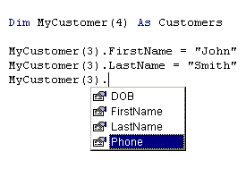

<div align="center">

## Advanced User Defined Types


</div>

### Description

Follow up to my first article on User Defined Types. Shows how to really put them to work. If you liked the first one, you will LOVE this one.
 
### More Info
 


<span>             |<span>
---                |---
**Submitted On**   |
**By**             |[Matthew Roberts](https://github.com/Planet-Source-Code/PSCIndex/blob/master/ByAuthor/matthew-roberts.md)
**Level**          |Intermediate
**User Rating**    |3.8 (42 globes from 11 users)
**Compatibility**  |VB 6\.0
**Category**       |[Data Structures](https://github.com/Planet-Source-Code/PSCIndex/blob/master/ByCategory/data-structures__1-33.md)
**World**          |[Visual Basic](https://github.com/Planet-Source-Code/PSCIndex/blob/master/ByWorld/visual-basic.md)
**Archive File**   |[](https://github.com/Planet-Source-Code/matthew-roberts-advanced-user-defined-types__1-14353/archive/master.zip)


### Source Code

```
<html xmlns:o="urn:schemas-microsoft-com:office:office"
xmlns:w="urn:schemas-microsoft-com:office:word"
xmlns="http://www.w3.org/TR/REC-html40">
<head>
<meta http-equiv=Content-Type content="text/html; charset=windows-1252">
<meta name=ProgId content=Word.Document>
<meta name=Generator content="Microsoft Word 9">
<meta name=Originator content="Microsoft Word 9">
<link rel=File-List href="./multidimtypes_files/filelist.xml">
<title>Creating Multi-Dimensional </title>
<!--[if gte mso 9]><xml>
 <o:DocumentProperties>
 <o:Author>Matt Roberts</o:Author>
 <o:LastAuthor>Matt Roberts</o:LastAuthor>
 <o:Revision>3</o:Revision>
 <o:TotalTime>37</o:TotalTime>
 <o:Created>2001-01-11T22:44:00Z</o:Created>
 <o:LastSaved>2001-01-11T23:01:00Z</o:LastSaved>
 <o:Pages>2</o:Pages>
 <o:Words>624</o:Words>
 <o:Characters>3557</o:Characters>
 <o:Company>Televox Software</o:Company>
 <o:Lines>29</o:Lines>
 <o:Paragraphs>7</o:Paragraphs>
 <o:CharactersWithSpaces>4368</o:CharactersWithSpaces>
 <o:Version>9.3821</o:Version>
 </o:DocumentProperties>
</xml><![endif]-->
<style>
<!--
 /* Style Definitions */
p.MsoNormal, li.MsoNormal, div.MsoNormal
	{mso-style-parent:"";
	margin:0in;
	margin-bottom:.0001pt;
	mso-pagination:widow-orphan;
	font-size:10.0pt;
	mso-bidi-font-size:8.0pt;
	font-family:Arial;
	mso-fareast-font-family:"Arial";
	mso-bidi-font-family:"Arial";
	color:windowtext;}
h1
	{mso-style-next:Normal;
	margin:0in;
	margin-bottom:.0001pt;
	text-align:center;
	mso-pagination:widow-orphan;
	page-break-after:avoid;
	mso-outline-level:1;
	font-size:10.0pt;
	mso-bidi-font-size:8.0pt;
	font-family:Arial;
	color:windowtext;
	mso-font-kerning:0pt;
	font-weight:bold;}
p.MsoTitle, li.MsoTitle, div.MsoTitle
	{margin:0in;
	margin-bottom:.0001pt;
	text-align:center;
	mso-pagination:widow-orphan;
	font-size:8.0pt;
	font-family:Arial;
	mso-fareast-font-family:"Arial";
	mso-bidi-font-family:"Arial";
	color:windowtext;}
p.MsoBodyTextIndent, li.MsoBodyTextIndent, div.MsoBodyTextIndent
	{margin-top:0in;
	margin-right:0in;
	margin-bottom:0in;
	margin-left:.25in;
	margin-bottom:.0001pt;
	mso-pagination:widow-orphan;
	font-size:10.0pt;
	mso-bidi-font-size:8.0pt;
	font-family:Arial;
	mso-fareast-font-family:"Arial";
	mso-bidi-font-family:"Arial";
	color:windowtext;}
a:link, span.MsoHyperlink
	{color:blue;
	text-decoration:underline;
	text-underline:single;}
a:visited, span.MsoHyperlinkFollowed
	{color:purple;
	text-decoration:underline;
	text-underline:single;}
p
	{margin-right:0in;
	mso-margin-top-alt:auto;
	mso-margin-bottom-alt:auto;
	margin-left:0in;
	mso-pagination:widow-orphan;
	font-size:8.0pt;
	font-family:"Arial";
	mso-fareast-font-family:"Arial";
	color:black;}
@page Section1
	{size:8.5in 11.0in;
	margin:1.0in 1.25in 1.0in 1.25in;
	mso-header-margin:.5in;
	mso-footer-margin:.5in;
	mso-paper-source:0;}
div.Section1
	{page:Section1;}
-->
</style>
</head>
<body lang=EN-US link=blue vlink=purple style='tab-interval:.5in'>
<div class=Section1>
<p class=MsoNormal align=center style='text-align:center'><b><span
style='font-size:16.0pt;mso-bidi-font-size:12.0pt;mso-bidi-font-family:Arial'>Creating
Multi-Dimensional<o:p></o:p></span></b></p>
<h1><span style='font-size:16.0pt;mso-bidi-font-size:8.0pt'>User Defined Types</span></h1>
<p class=MsoNormal><span style='mso-bidi-font-family:Arial'><![if !supportEmptyParas]>&nbsp;<![endif]><o:p></o:p></span></p>
<p class=MsoNormal><span style='mso-bidi-font-family:Arial'><![if !supportEmptyParas]>&nbsp;<![endif]><o:p></o:p></span></p>
<p class=MsoNormal><span style='mso-bidi-font-family:Arial'>This is a follow-up
for my tutorial &#8220;<a
href="http://www.planetsourcecode.com/xq/ASP/txtCodeId.8370/lngWId.1/qx/vb/scripts/ShowCode.htm">Create
your own User Defined Types &#8211; A Basic User Defined Type Tutorial</a>.&#8221;<span
style="mso-spacerun: yes">  </span>You should read it first if you are not
familiar with User Defined Types.<o:p></o:p></span></p>
<p class=MsoNormal><span style='mso-bidi-font-family:Arial'><![if !supportEmptyParas]>&nbsp;<![endif]><o:p></o:p></span></p>
<p class=MsoNormal><span style='mso-bidi-font-family:Arial'>In my first
article, I showed how to easily create you own custom data storage types. With
these, you could keep related pieces of information in one easy to use place.
For example, you could have a &#8220;Customer &#8220; user defined type and store
information like this:<o:p></o:p></span></p>
<p class=MsoNormal><span style='mso-bidi-font-family:Arial'><![if !supportEmptyParas]>&nbsp;<![endif]><o:p></o:p></span></p>
<p class=MsoNormal><span style='mso-bidi-font-family:Arial'><span
style='mso-tab-count:1'>            </span>Customer.FirstName = &#8220;John&#8221;<o:p></o:p></span></p>
<p class=MsoNormal><span style='mso-bidi-font-family:Arial'><span
style='mso-tab-count:1'>            </span>Customer.LastName = &#8220; Smith&#8221;<o:p></o:p></span></p>
<p class=MsoNormal><span style='mso-bidi-font-family:Arial'><![if !supportEmptyParas]>&nbsp;<![endif]><o:p></o:p></span></p>
<p class=MsoNormal><span style='mso-bidi-font-family:Arial'>In addition to
being able to tie these pieces of data together in one variable name
(customer), you also have the really cool ability to see your choices in a
drop-down list just like the built-in Visual Basic object properties.<o:p></o:p></span></p>
<p class=MsoNormal><span style='mso-bidi-font-family:Arial'><![if !supportEmptyParas]>&nbsp;<![endif]><o:p></o:p></span></p>
<p class=MsoNormal><span style='mso-bidi-font-family:Arial'>In this article, I
would like to show you how to expand that capability to multiple instances of
the user defined type. Let me explain. It is nice to have a variable in your
application that holds similar information, but what if you are working with
three different customers and want to manage information for all of them? There
are a couple of ways to accomplish this:<o:p></o:p></span></p>
<p class=MsoNormal><span style='mso-bidi-font-family:Arial'><![if !supportEmptyParas]>&nbsp;<![endif]><o:p></o:p></span></p>
<p class=MsoNormal><span style='mso-bidi-font-family:Arial'>Consider what you
do if you want to hold several strings separately:<o:p></o:p></span></p>
<p class=MsoNormal><span style='mso-bidi-font-family:Arial'><![if !supportEmptyParas]>&nbsp;<![endif]><o:p></o:p></span></p>
<p class=MsoNormal><span style='mso-bidi-font-family:Arial'>Dim strOne As
String<o:p></o:p></span></p>
<p class=MsoNormal><span style='mso-bidi-font-family:Arial'>Dim strTwo As
String<o:p></o:p></span></p>
<p class=MsoNormal><span style='mso-bidi-font-family:Arial'>Dim strThree As
String<o:p></o:p></span></p>
<p class=MsoNormal><span style='mso-bidi-font-family:Arial'><![if !supportEmptyParas]>&nbsp;<![endif]><o:p></o:p></span></p>
<p class=MsoNormal><span style='mso-bidi-font-family:Arial'>You can define as
many variables as you like with the type of &#8220;string&#8221; because &#8220;string&#8221; is a
Visual Basic data type. Well VB gives you the power to create your own data
types, made up of standard variable types. <o:p></o:p></span></p>
<p class=MsoNormal><span style='mso-bidi-font-family:Arial'><![if !supportEmptyParas]>&nbsp;<![endif]><o:p></o:p></span></p>
<p class=MsoNormal><span style='mso-bidi-font-family:Arial'>To do the same
thing with a user defined type, do this:<o:p></o:p></span></p>
<p class=MsoNormal><span style='mso-bidi-font-family:Arial'><![if !supportEmptyParas]>&nbsp;<![endif]><o:p></o:p></span></p>
<p class=MsoNormal><span style='mso-bidi-font-family:Arial'>Type Customer<o:p></o:p></span></p>
<p class=MsoNormal style='text-indent:.5in'><span style='mso-bidi-font-family:
Arial'>FirstName As String<o:p></o:p></span></p>
<p class=MsoNormal style='text-indent:.5in'><span style='mso-bidi-font-family:
Arial'>LastName As String<o:p></o:p></span></p>
<p class=MsoNormal style='text-indent:.5in'><span style='mso-bidi-font-family:
Arial'>Phone As String<o:p></o:p></span></p>
<p class=MsoNormal style='text-indent:.5in'><span style='mso-bidi-font-family:
Arial'>DOB as Date<o:p></o:p></span></p>
<p class=MsoNormal><span style='mso-bidi-font-family:Arial'>End Type<o:p></o:p></span></p>
<p class=MsoNormal><span style='mso-bidi-font-family:Arial'><![if !supportEmptyParas]>&nbsp;<![endif]><o:p></o:p></span></p>
<p class=MsoNormal><span style='mso-bidi-font-family:Arial'>Now you can create
multiple variables of the same type:<o:p></o:p></span></p>
<p class=MsoNormal><span style='mso-bidi-font-family:Arial'><![if !supportEmptyParas]>&nbsp;<![endif]><o:p></o:p></span></p>
<p class=MsoNormal><span style='mso-bidi-font-family:Arial'>Dim Customer1 As
Customer<o:p></o:p></span></p>
<p class=MsoNormal><span style='mso-bidi-font-family:Arial'>Dim Customer2 As
Customer<o:p></o:p></span></p>
<p class=MsoNormal><span style='mso-bidi-font-family:Arial'>Dim Customer3 As
Customer<o:p></o:p></span></p>
<p class=MsoNormal><span style='mso-bidi-font-family:Arial'><![if !supportEmptyParas]>&nbsp;<![endif]><o:p></o:p></span></p>
<p class=MsoNormal><span style='mso-bidi-font-family:Arial'>Just as with any
other variable type, you can add different information to each and it will
remain with the variable you assigned it to:<o:p></o:p></span></p>
<p class=MsoNormal><span style='mso-bidi-font-family:Arial'><![if !supportEmptyParas]>&nbsp;<![endif]><o:p></o:p></span></p>
<p class=MsoNormal><span style='mso-bidi-font-family:Arial'>Customer1.Phone =
&#8220;555-1234&#8221;<o:p></o:p></span></p>
<p class=MsoNormal><span style='mso-bidi-font-family:Arial'>Customer1.FirstName=&#8221;John&#8221;<o:p></o:p></span></p>
<p class=MsoNormal><span style='mso-bidi-font-family:Arial'>Customer1.LastName=&#8221;Smith&#8221;<o:p></o:p></span></p>
<p class=MsoNormal><span style='mso-bidi-font-family:Arial'><![if !supportEmptyParas]>&nbsp;<![endif]><o:p></o:p></span></p>
<p class=MsoNormal><span style='mso-bidi-font-family:Arial'>Customer2.Phone =
&#8220;555-1111&#8221;<o:p></o:p></span></p>
<p class=MsoNormal><span style='mso-bidi-font-family:Arial'>Customer1.FirstName=&#8221;Jane&#8221;<o:p></o:p></span></p>
<p class=MsoNormal><span style='mso-bidi-font-family:Arial'>Customer1.LastName=&#8221;Doe&#8221;<o:p></o:p></span></p>
<p class=MsoNormal><span style='mso-bidi-font-family:Arial'><![if !supportEmptyParas]>&nbsp;<![endif]><o:p></o:p></span></p>
<p class=MsoNormal><span style='mso-bidi-font-family:Arial'>Customer3.Phone =
&#8220;123-4567&#8221;<o:p></o:p></span></p>
<p class=MsoNormal><span style='mso-bidi-font-family:Arial'>Customer3.FirstName=&#8221;Jane&#8221;<o:p></o:p></span></p>
<p class=MsoNormal><span style='mso-bidi-font-family:Arial'>Customer3.LastName=&#8221;Doe&#8221;<o:p></o:p></span></p>
<p class=MsoNormal><span style='mso-bidi-font-family:Arial'><![if !supportEmptyParas]>&nbsp;<![endif]><o:p></o:p></span></p>
<p class=MsoNormal><span style='mso-bidi-font-family:Arial'><![if !supportEmptyParas]>&nbsp;<![endif]><o:p></o:p></span></p>
<p class=MsoNormal><span style='mso-bidi-font-family:Arial'>How is that for
cool?<o:p></o:p></span></p>
<p class=MsoNormal><span style='mso-bidi-font-family:Arial'><![if !supportEmptyParas]>&nbsp;<![endif]><o:p></o:p></span></p>
<p class=MsoNormal><span style='mso-bidi-font-family:Arial'>But wait, it gets
better. What if you don&#8217;t know how many customers you will be working with?
What then? Do you create 100 of these variables and hope you never need more?
Certainly not! Again, think about how you would do it with a string variable:<br
style='mso-special-character:line-break'>
<![if !supportLineBreakNewLine]><br style='mso-special-character:line-break'>
<![endif]><o:p></o:p></span></p>
<p class=MsoNormal><span style='mso-bidi-font-family:Arial'>Dim strTest(4) As
String<o:p></o:p></span></p>
<p class=MsoNormal><span style='mso-bidi-font-family:Arial'><![if !supportEmptyParas]>&nbsp;<![endif]><o:p></o:p></span></p>
<p class=MsoNormal><span style='mso-bidi-font-family:Arial'>This creates a
string array with 4 elements. You can access each element by changing the index
number:<o:p></o:p></span></p>
<p class=MsoNormal><span style='mso-bidi-font-family:Arial'><![if !supportEmptyParas]>&nbsp;<![endif]><o:p></o:p></span></p>
<p class=MsoNormal><span style='mso-bidi-font-family:Arial'><span
style='mso-tab-count:1'>            </span>StrTest(0) = &#8220;Hello&#8221;<o:p></o:p></span></p>
<p class=MsoNormal><span style='mso-bidi-font-family:Arial'><span
style='mso-tab-count:1'>            </span>StrTest(1) = &#8220;How&#8221;<o:p></o:p></span></p>
<p class=MsoNormal><span style='mso-bidi-font-family:Arial'><span
style='mso-tab-count:1'>            </span>StrTest(2) = &#8220;Are&#8221; <o:p></o:p></span></p>
<p class=MsoNormal><span style='mso-bidi-font-family:Arial'><span
style='mso-tab-count:1'>            </span>StrTest(3) = &#8220;You?&#8221;<o:p></o:p></span></p>
<p class=MsoNormal><span style='mso-bidi-font-family:Arial'><![if !supportEmptyParas]>&nbsp;<![endif]><o:p></o:p></span></p>
<p class=MsoNormal><span style='mso-bidi-font-family:Arial'><![if !supportEmptyParas]>&nbsp;<![endif]><o:p></o:p></span></p>
<p class=MsoNormal><span style='mso-bidi-font-family:Arial'>Doing this: <o:p></o:p></span></p>
<p class=MsoNormal><span style='mso-bidi-font-family:Arial'><![if !supportEmptyParas]>&nbsp;<![endif]><o:p></o:p></span></p>
<p class=MsoNormal><span style='mso-bidi-font-family:Arial'><span
style='mso-tab-count:1'>            </span>For intTest = 0 To 3<o:p></o:p></span></p>
<p class=MsoNormal><span style='mso-bidi-font-family:Arial'><span
style='mso-tab-count:2'>                        </span>Msgbox strTest(intTest)<o:p></o:p></span></p>
<p class=MsoNormal><span style='mso-bidi-font-family:Arial'><span
style='mso-tab-count:1'>            </span>Next intTest<o:p></o:p></span></p>
<p class=MsoNormal><span style='mso-bidi-font-family:Arial'><![if !supportEmptyParas]>&nbsp;<![endif]><o:p></o:p></span></p>
<p class=MsoNormal><span style='mso-bidi-font-family:Arial'>Will loop through
this array and put each element in its own message box. Why? I have no idea&#8230;but
I am trying to make a point here.<o:p></o:p></span></p>
<p class=MsoNormal><span style='mso-bidi-font-family:Arial'><![if !supportEmptyParas]>&nbsp;<![endif]><o:p></o:p></span></p>
<p class=MsoNormal><span style='mso-bidi-font-family:Arial'>You can do the same
thing by defining the type YOU created as an array:<o:p></o:p></span></p>
<p class=MsoNormal><span style='mso-bidi-font-family:Arial'><![if !supportEmptyParas]>&nbsp;<![endif]><o:p></o:p></span></p>
<p class=MsoNormal style='text-indent:.5in'><span style='mso-bidi-font-family:
Arial'>Dim MyCustomers(4) As Customers <o:p></o:p></span></p>
<p class=MsoNormal><span style='mso-bidi-font-family:Arial'><![if !supportEmptyParas]>&nbsp;<![endif]><o:p></o:p></span></p>
<p class=MsoNormal><span style='mso-bidi-font-family:Arial'><span
style='mso-tab-count:1'>            </span>MyCustomers(0).FirstName = &#8220;John&#8221;<o:p></o:p></span></p>
<p class=MsoNormal><span style='mso-bidi-font-family:Arial'><span
style='mso-tab-count:1'>            </span>MyCustomers(0).LastName = &#8220;Smith&#8221;<o:p></o:p></span></p>
<p class=MsoNormal><span style='mso-bidi-font-family:Arial'><![if !supportEmptyParas]>&nbsp;<![endif]><o:p></o:p></span></p>
<p class=MsoNormal style='text-indent:.5in'><span style='mso-bidi-font-family:
Arial'>MyCustomers(1).FirstName = &#8220;Jane&#8221;<o:p></o:p></span></p>
<p class=MsoNormal><span style='mso-bidi-font-family:Arial'><span
style='mso-tab-count:1'>            </span>MyCustomers(1).LastName = &#8220;Doe&#8221;<o:p></o:p></span></p>
<p class=MsoNormal><span style='mso-bidi-font-family:Arial'><![if !supportEmptyParas]>&nbsp;<![endif]><o:p></o:p></span></p>
<p class=MsoNormal style='text-indent:.5in'><span style='mso-bidi-font-family:
Arial'>MyCustomers(2).FirstName = &#8220;Sue&#8221;<o:p></o:p></span></p>
<p class=MsoNormal style='text-indent:.5in'><span style='mso-bidi-font-family:
Arial'>MyCustomers(2).LastName = &#8220;Thomas&#8221;<o:p></o:p></span></p>
<p class=MsoNormal><span style='mso-bidi-font-family:Arial'><![if !supportEmptyParas]>&nbsp;<![endif]><o:p></o:p></span></p>
<p class=MsoNormal><span style='mso-bidi-font-family:Arial'><span
style='mso-tab-count:1'>            </span>MyCustomers(3).FirstName = &#8220;Al&#8221;<o:p></o:p></span></p>
<p class=MsoNormal><span style='mso-bidi-font-family:Arial'><span
style='mso-tab-count:1'>            </span>MyCustomers(3).LastName = &#8220;Anderson&#8221;<o:p></o:p></span></p>
<p class=MsoNormal><span style='mso-bidi-font-family:Arial'><![if !supportEmptyParas]>&nbsp;<![endif]><o:p></o:p></span></p>
<p class=MsoNormal><span style='mso-bidi-font-family:Arial'><span
style='mso-tab-count:1'>            </span>For intTest = 0 To 3<o:p></o:p></span></p>
<p class=MsoNormal><span style='mso-bidi-font-family:Arial'><span
style='mso-tab-count:2'>                        </span>Msgbox
MyCustomers(intTest).FirstName<o:p></o:p></span></p>
<p class=MsoNormal><span style='mso-bidi-font-family:Arial'><span
style='mso-tab-count:1'>            </span>Next intTest<o:p></o:p></span></p>
<p class=MsoNormal><span style='mso-bidi-font-family:Arial'><![if !supportEmptyParas]>&nbsp;<![endif]><o:p></o:p></span></p>
<p class=MsoNormal><span style='mso-bidi-font-family:Arial'>At this point, your
User Defined Type starts to resemble a recordset in many ways, but requires
much less overhead than a recordset object does. If you use your imagination,
you can see how this would be very powerful when you substitute a variable in
your array declaration like this:<o:p></o:p></span></p>
<p class=MsoNormal><span style='mso-bidi-font-family:Arial'><![if !supportEmptyParas]>&nbsp;<![endif]><o:p></o:p></span></p>
<p class=MsoNormal style='text-indent:.5in'><span style='mso-bidi-font-family:
Arial'>Dim MyCustomers(intCustomerCount) as Customers<o:p></o:p></span></p>
<p class=MsoNormal><span style='mso-bidi-font-family:Arial'><![if !supportEmptyParas]>&nbsp;<![endif]><o:p></o:p></span></p>
<p class=MsoNormal><span style='mso-bidi-font-family:Arial'>Then you can loop
through the collection by incrementing an index variable. In this example, you
would add all customers to a listbox control on a form.<o:p></o:p></span></p>
<p class=MsoNormal><span style='mso-bidi-font-family:Arial'><![if !supportEmptyParas]>&nbsp;<![endif]><o:p></o:p></span></p>
<p class=MsoNormal style='text-indent:.5in'><span style='mso-bidi-font-family:
Arial'>For intCustNumber = 0 to Ubound(MyCustomers) &#8211; 1<o:p></o:p></span></p>
<p class=MsoNormal><span style='mso-bidi-font-family:Arial'><span
style='mso-tab-count:2'>                        </span>ListBox1.Add MyCustomer(intCustNumber).FirstName
&amp; MyCust</span>omer(intCustNumber).LastName</p>
<p class=MsoNormal style='text-indent:.5in'><span style='mso-bidi-font-family:
Arial'>Next intCustNumber<o:p></o:p></span></p>
<p class=MsoNormal><span style='mso-bidi-font-family:Arial'><![if !supportEmptyParas]>&nbsp;<![endif]><o:p></o:p></span></p>
<p class=MsoNormal><span style='mso-bidi-font-family:Arial'>I have found many
uses for this concept in my applications and am sure that if you are curious
enough, you will as well. If you come up with some novel uses for it, please
email me and let me know: <a href="mailto:mmroberts@usa.net">mmroberts@usa.net</a><o:p></o:p></span></p>
</div>
</body>
</html>
```

